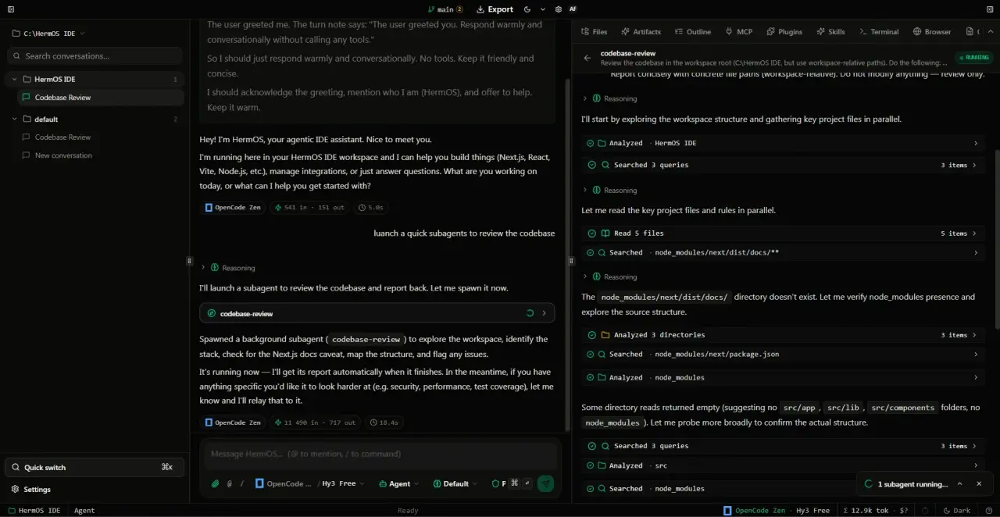

# HermOS IDE — Local-First AI Coding Environment

**Your code stays on your machine. Your models, your keys, your data — never leaves your device.**

HermOS IDE is a desktop code editor with a built-in autonomous coding agent. It runs entirely offline on your computer: edit files, run commands, browse the web, and generate documents — all powered by your own AI provider keys. No accounts, no cloud, no telemetry.

---

## Why HermOS?

- **100% Local & Private** — All data lives in a local SQLite database on your machine. No remote servers, no tracking.
- **Bring Your Own Keys** — Works with OpenAI, Anthropic Claude, Groq, Mistral, Together, Ollama (local), and more. You control which model runs.
- **Agent That Codes** — Chat, Architect, and Agent modes handle everything from quick questions to multi-step refactors.
- **Works Offline** — Once installed, the editor, terminal, and local models (Ollama) run without internet.
- **Extensible** — Model Context Protocol (MCP) servers, plugins, and skills extend the agent with your own tools.

---

## Features

| | |
|---|---|
| **Autonomous Agent** | Multi-step coding tasks: read, edit, run, test — locally. |
| **Integrated Terminal** | Full shell access rooted in your project folder (commands run with your OS privileges). |
| **Built-in Browser** | Headless browser panel synced to the editor for live previews. |
| **MCP Support** | Connect any stdio/SSE MCP server (filesystem, GitHub, databases…). |
| **Office Builder** | Generate PPTX, DOCX, and PDF directly from the agent. |
| **Plugins & Skills** | Install community tools or build your own. |
| **Cross-Platform** | Native installers for Windows, macOS (Apple Silicon & Intel), and Linux. |

---

## Download

Get the latest release for your platform:

| Platform | Download |
|---|---|
| **Windows** | [HermOS IDE for Windows](https://github.com/WFekik/HermOS-IDE/releases/latest) — grab the `.msi` under Assets |
| **macOS** | [HermOS IDE for macOS](https://github.com/WFekik/HermOS-IDE/releases/latest) — Apple Silicon & Intel, grab the universal `.dmg` |
| **Linux** | [HermOS IDE for Linux](https://github.com/WFekik/HermOS-IDE/releases/latest) — grab the `.deb` under Assets |

Or browse all assets on the [Releases page](https://github.com/WFekik/HermOS-IDE/releases/latest).

> **Website & Docs:** https://hermos.is-a.dev/

---

## Getting Started (3 Steps)

### 1. Install
Download and run the installer for your OS. On first launch HermOS creates its local data folder and encryption keys — no setup wizard, no login.

### 2. Add a Provider Key
Open **Settings → Providers** and paste an API key:

- **Cloud**: OpenAI, Anthropic, Groq, Mistral, Together, OpenRouter, NVIDIA NIM, Zen …
- **Local (offline)**: [Ollama](https://ollama.com) — run `ollama serve` and add `http://localhost:11434/v1`

Keys are encrypted at rest with a per-install secret.

### 3. Start Coding
- **Open a folder** — click the project selector in the top bar → “Open Folder / New Project” (desktop) or use the Files panel, or drop files into the workspace.
- **Ask the agent** — `Chat` for Q&A, `Architect` for planning, `Agent` for autonomous execution.
- **Run & preview** — The terminal and browser panel are right inside the IDE.

---

## Privacy & Security

- **Local-first** — Database, uploads, and secrets live under your OS app-data folder (`%APPDATA%\com.hermos.ide` on Windows, `~/.config` on Linux, `~/Library/Application Support` on macOS). Nothing is sent to HermOS servers — there are none.
- **Encrypted keys** — Provider API keys are stored AES-256-GCM encrypted. The encryption key is generated per install and never leaves your device.
- **No telemetry** — No analytics, no crash reporting, no update phoning home beyond the optional GitHub Releases check.
- **Loopback only** — The bundled server binds to `127.0.0.1` and rejects non-local requests.

---

## System Requirements

- **Windows** 10/11 (x64) · **macOS** 12+ (Apple Silicon & Intel) · **Linux** (Ubuntu 22.04+ / Debian)
- 4 GB RAM minimum, 8 GB recommended
- ~300 MB disk for the app + space for your projects
- For local models: Ollama + a capable GPU recommended

---

## FAQ

**Is HermOS free?**
Yes — MIT licensed. You only pay your AI provider (or run Ollama for free locally).

**Does it need internet?**
Only to call cloud model APIs. The editor, terminal, file tools, and Ollama work fully offline.

**Where is my data?**
On your machine. Uninstalling the app does not delete the data folder — remove it manually if desired.

**Can I use it on a shared machine?**
HermOS is single-user, bound to the OS account that installed it.

---

## Support & Contributing

- **Issues & feature requests:** [GitHub Issues](https://github.com/WFekik/HermOS-IDE/issues)
- **For developers:** See [CONTRIBUTING.md](CONTRIBUTING.md) for build, test, and packaging instructions.

---

## License

MIT — see [LICENSE](LICENSE).
